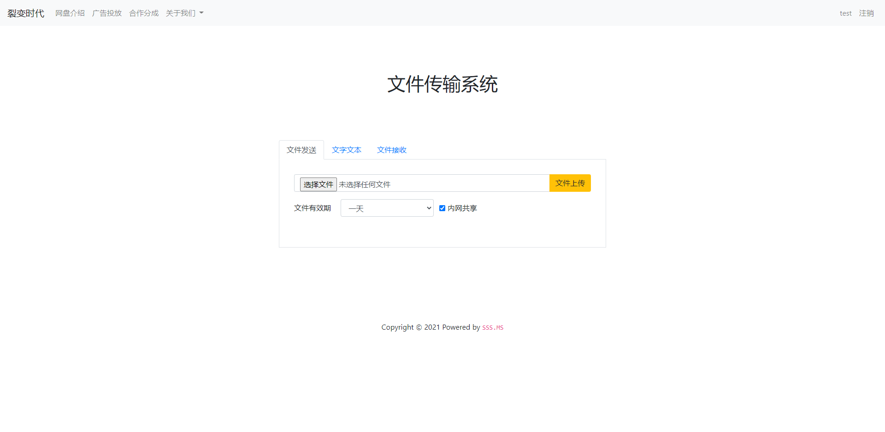
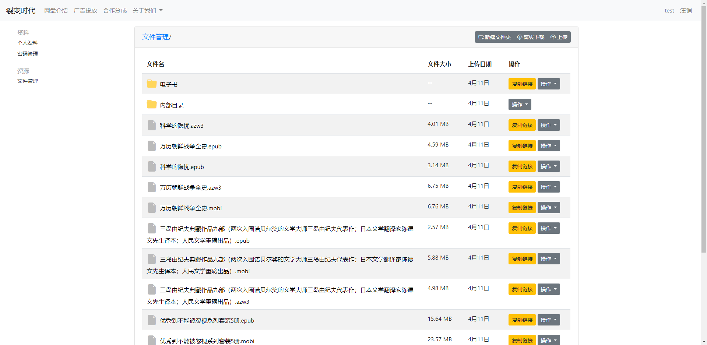
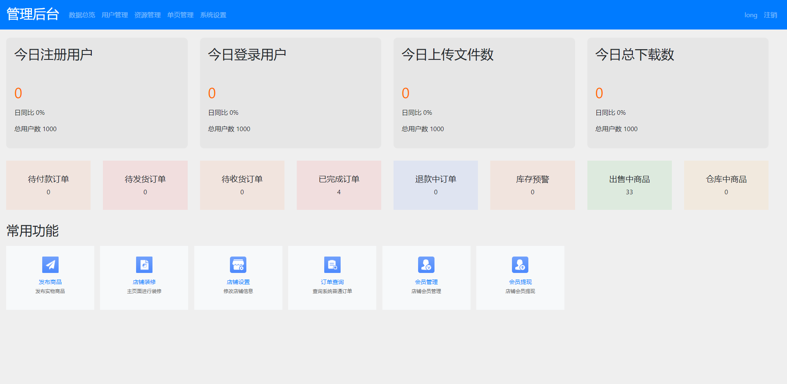
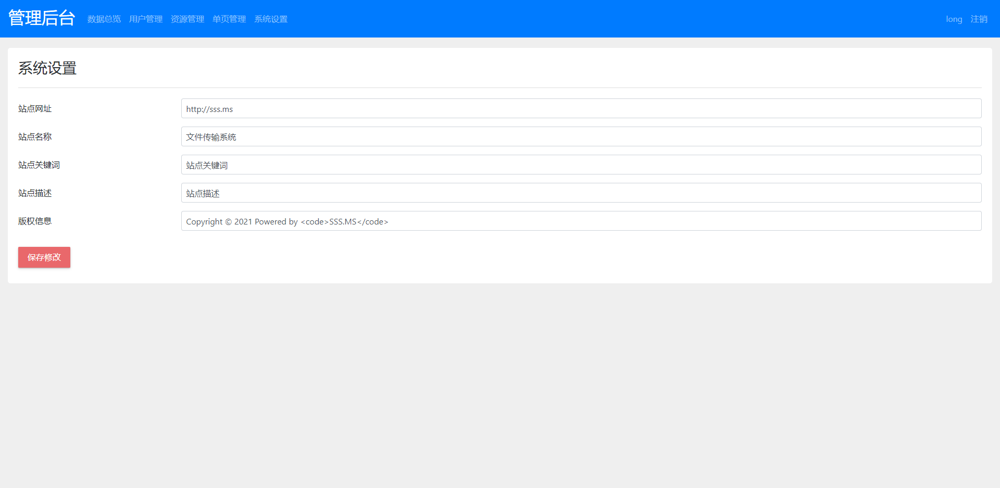

# sss.ms 文件传输分享系统

这是一个轻量化的文件分享系统，主打匿名临时分享。 支持阅后即焚，一天有效期，一周有效期间和永久有效。

不依赖任何框架，打造最近精简，好用的文件分享系统。但是不止于文件分享系统，可以胜任一切web项目

这是我们第一个准备商业化的开源项目 持续更新 免费使用， 永不收费

> 新增演示地址： [http://liebianshidai.com/](http://liebianshidai.com/)
>
> 此乃正式运营的网站 故而不提供后台演示功能

## 前台功能规划

+ 文件分享
    + 阅后即焚
    + 内网共享
    + 一天有效
    + 一周有效
    + 永久有效

+ 文件管理 
    + 文件上传
    + 离线下载  [未完成]
    + 文件夹创建
    + 文件夹分享
    + 文件删除
    + 文件重命名 [未完成]

+ 个人中心  
    + 用户登录
    + 用户注册
    + 修改昵称
    + 修改密码
    + 修改个人简介

+ 文本分享
    + 阅后即焚
    + 内网共享
    + 一天有效
    + 一周有效
    + 永久有效

## 后台功能规划

+ 用户管理
+ 文件管理
+ 单页管理
+ 系统设置

## 开发环境
php7.4
mysql 5.7
